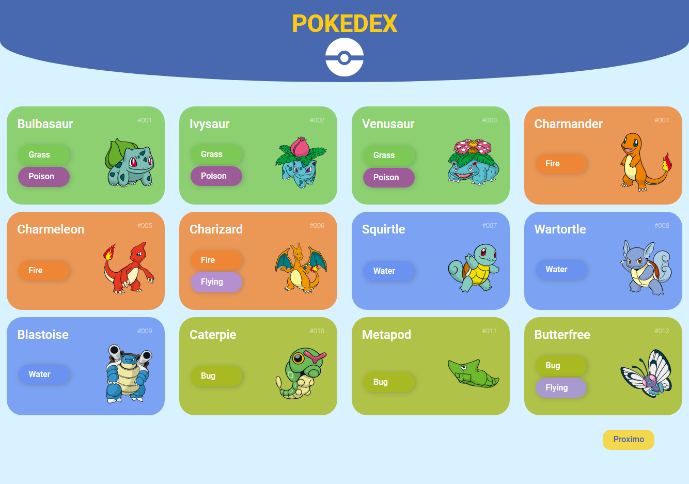
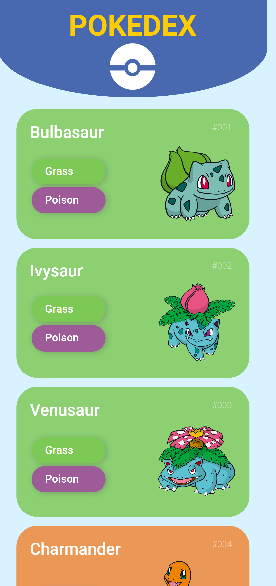

# POKEDEX

Essa é a Pokedex desenvolvida no curso [Orange Tech +](https://www.dio.me/bootcamp/orange-tech?ref=CG)

## Sumário

 - [Projeto](#projeto)
    - [O desafio](#o-desafio)
  - [O processo](#o-processo)
    - [Tecnologias utilizadas](#tecnologias-utilizadas)
    - [O que aprendi](#o-que-aprendi)
    - [Continua?](#continua)
  - [Autora](#autora)

## Projeto

### O desafio

Nessa aplicação o usuário deve:

- Ver uma lista de (12) pokemons organizados em ordem crescente pelo seu ID
- Pular ou voltar a página de exibição
- Ver o layout adaptado ao tamanho da tela do seu dispositivo
- Ver estado de hover em elementos interativos



### [Link da solução](https://mailacss.netlify.app/pokedex/)

## O processo

### Tecnologias utilizadas

- HTML5
- CSS
  - Flexbox
  - Grid
- Javascript
- Mobile-first

### O que aprendi

Considero os maiores aprendizados desse projeto:

- Consumo de **API** (PokeApi)
- Construção de **models**
- Utilização do método mobile first
- Uso de **Arrow Functions**

```javascript
pokeApi.getPokemons = (offset = 0, limit = 8) => {
    const url = `https://pokeapi.co/api/v2/pokemon?offset=${offset}&limit=${limit}` 

    return fetch(url)
    .then((response) => response.json())
```
| Imagem 1 | Imagem 2 | Imagem 3 |
|----------|----------|----------|
|  |   |  |
  


### Continua?

- Há planos para:
  - adicionar mecanismo de busca
  - adicionar card com mais detalhes do pokemon

## Autora
 - [ ](https://github.com/mailacss)

- LinkedIn - [Maila Cardoso](https://www.linkedin.com/in/maila-cssantos/)

