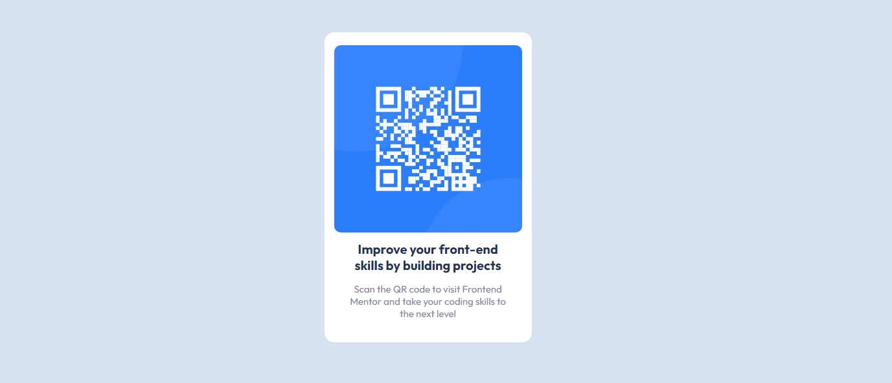

# Frontend Mentor - QR Code Component
Essa é a solução do projeto [QR code component](https://www.frontendmentor.io/solutions/qr-code-screen-RJolZX2fSe).

## Sumário

 - [Projeto](#projeto)
    - [Screenshot](#screenshot)
    - [Links](#links)
  - [O processo](#o-processo)
    - [Feito com](#feito-com)
  - [Autora](#autora)

## Projeto

### Screenshot

### Links

- [Link da solução](https://mailacss.netlify.app/qr%20code/)
- [Link do projeto](https://www.frontendmentor.io/solutions/qr-code-screen-RJolZX2fSe)

## O processo

### Feito com

- HTML5
- CSS
  - Flexbox

## Autora
 - 

- Frontend Mentor - [@mailacss](https://www.frontendmentor.io/profile/mailacss)
- LinkedIn - [Maila Cardoso](https://www.linkedin.com/in/maila-cssantos/)

