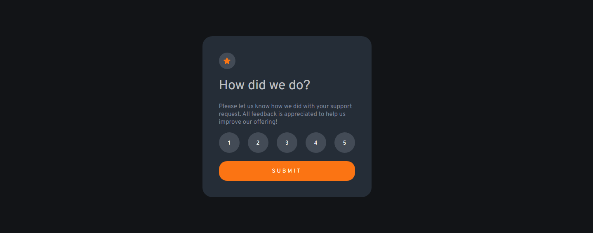
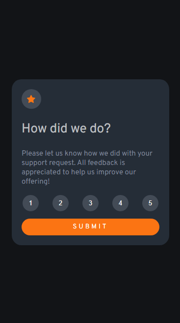

# Frontend Mentor - Product preview card component solution
Essa é a solução do projeto [Product Preview Card Component Challenge do Frontend Mentor](https://www.frontendmentor.io/challenges/interactive-rating-component-koxpeBUmI).

## Sumário

 - [Projeto](#projeto)
    - [O desafio](#o-desafio)
    - [Screenshot](#screenshot)
    - [Links](#links)
  - [O processo](#o-processo)
    - [Feito com](#feito-com)
    - [O que aprendi](#o-que-aprendi)
  - [Autora](#autora)

## Projeto

### O desafio

Nessa aplicação os usuários devem ser capazes de:

- Ver o layout adaptado ao tamanho da tela do seu dispositivo
- Ver estado de hover e transições nos elementos interativos
- Escolher e enviar nota
- Ver tela de agradecimento após selecionar nota

### Screenshot




### Links

- [Link da solução](https://mailacss.netlify.app/tela%20de%20avaliacao/)
- [Link do projeto](https://www.frontendmentor.io/solutions/tela-de-avaliao-responsiva-utilizando-css-e-javascript-6LWSf8WUTv)

## O processo

### Feito com

- HTML5
- CSS
  - Flexbox
- Javascript

### O que aprendi

Considero os maiores aprendizados desse projeto:

- Adaptação da altura de divs

```css
.container {
    background-color: hsl(213, 19%, 18%);
    width: 330px;
    height: auto;
}
```

- Criar restrição: somente passar para outra tela caso tenha nota selecionada.
- Efeitos e transições ao passar e clicar o mouse

```css
.op:hover { 
    background-color: hsl(25, 97%, 53%);
    color: white;
    transition: 0.5s;
}
.op:focus{
    transition: 1s;
    background-color: hsl(216, 12%, 54%);
    color: white;
}
```




## Autora
 - [ ](https://github.com/mailacss)

- Frontend Mentor - [@mailacss](https://www.frontendmentor.io/profile/mailacss)
- LinkedIn - [Maila Cardoso](https://www.linkedin.com/in/maila-cssantos/)

