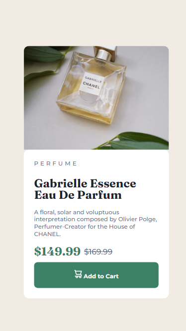

# Frontend Mentor - Product preview card component solution
Essa é a solução do projeto [Product Preview Card Component Challenge do Frontend Mentor](https://www.frontendmentor.io/challenges/product-preview-card-component-GO7UmttRfa).

## Sumário

 - [Projeto](#projeto)
    - [O desafio](#o-desafio)
    - [Screenshot](#screenshot)
    - [Links](#links)
  - [O processo](#o-processo)
    - [Feito com](#feito-com)
    - [O que aprendi](#o-que-aprendi)
    - [Continua?](#continua)
  - [Autora](#autora)

## Projeto

### O desafio

Nessa aplicação os usuários devem ser capazes de:

- Ver o layout adaptado ao tamanho da tela do seu dispositivo
- Ver estado de hover em elementos interativos

### Screenshot


### Links

- [Link da solução](https://silver-mousse-4d4acd.netlify.app/previewcard%20fem/)
- [Link do projeto](https://www.frontendmentor.io/challenges/product-preview-card-component-GO7UmttRfa)

## O processo

### Feito com

- HTML5
- CSS
  - Flexbox

### O que aprendi

Considero os maiores aprendizados desse projeto:

- Estilização de diferentes itens numa mesma div container

```html
<div id="prices">$149.99 <s>$169.99</s> </div>
```
- Utilização de @media para responsividade

```css
@media (max-width: 599px) {
}
```



### Continua?

- Há planos para adicionar animações com Javascript futuramente.

## Autora
 - [ ](https://github.com/mailacss)

- Frontend Mentor - [@mailacss](https://www.frontendmentor.io/profile/mailacss)
- LinkedIn - [Maila Cardoso](https://www.linkedin.com/in/maila-cssantos/)

